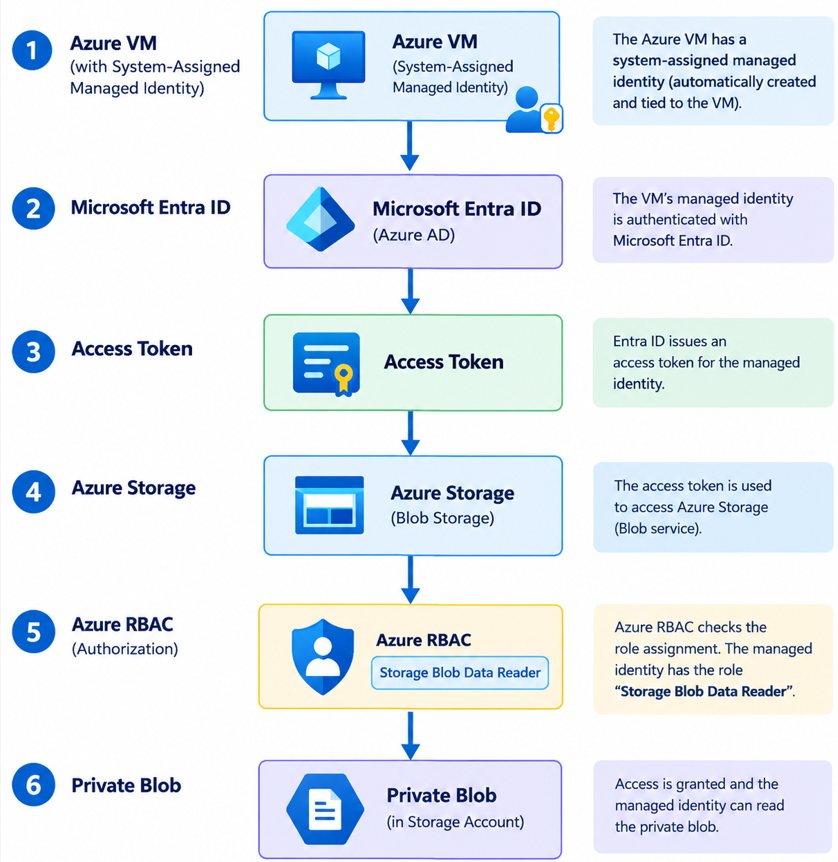

# Azure Managed Identity Lab

## 1. Overview
1. Overview
2. Objective
3. Scenario
4. Architecture
5. Lab Implementation
6. Authentication vs Authorization
7. Testing and Validation
8. Interview Questions
9. Key Learnings
10. References

## 2. Objective
The objective of this lab is to understand and demonstrate how Azure Managed Identity provides passwordless authentication from an Azure VM to Azure Blob Storage.
The lab demonstrates:
- System-Assigned Managed Identity
- Microsoft Entra ID authentication
- Azure RBAC authorization
- Accessing a private Blob using Managed Identity
  
## 3. Scenario
An application running on an Azure VM needs to read a private blob from Azure Storage.
Instead of storing a Storage Account key, password, or client secret, the VM uses its System-Assigned Managed Identity.
The Managed Identity obtains an access token and Azure RBAC determines whether the identity is allowed to access the blob.

## 4. Architecture

## 5. Lab Implementation
   ### Step 1 — Create Storage Account

Created an Azure Storage Account to store the test blob that will be accessed by the Azure VM using Managed Identity.

**Storage Account:** `milabstorage12345`

**Purpose:** Acts as the target Azure resource for the Managed Identity lab.

### Step 2 — Create Azure VM

Created an Ubuntu Azure Virtual Machine that represents the workload which will use Managed Identity to access Azure Storage.

**VM Name:** `mi-test-vm`

**Operating System:** Ubuntu

**Purpose:** The VM will use its Managed Identity to authenticate to Azure Storage without storing credentials.

### Step 3 — Enable System-Assigned Managed Identity

Enabled a System-Assigned Managed Identity on the Azure VM.

**Identity Type:** System-assigned

**Purpose:** Allows the VM to authenticate to Azure services without storing credentials such as passwords, client secrets, or storage keys.

### Step 4 — Assign Azure RBAC Role

Assigned the `Storage Blob Data Reader` role to the VM's System-Assigned Managed Identity at the Storage Account scope.

**Role:** Storage Blob Data Reader

**Purpose:** Allows the VM's Managed Identity to read data from Azure Blob Storage.

### Step 5 — Upload Test Blob

Uploaded a test file to the private Blob container.

**Container:** `test-container`

**Blob:** `README.md`

**Purpose:** This blob will be accessed from the VM using its Managed Identity.

### Step 6 — Connect to the VM

Connected to the Azure VM using SSH.

This provides access to the VM terminal where the Managed Identity will be used to authenticate to Azure services.

### Step 7 - Request Managed Identity Access Token
url -s -H "Metadata: true" \
  "http://169.254.169.254/metadata/identity/oauth2/token?api-version=2018-02-01&resource=https://storage.azure.com/"

The token was requested for Azure Storage.
Resource: https://storage.azure.com/
The returned access token was not stored or published.
Purpose: Proves that the VM can obtain an Azure Storage access token using its Managed Identity without storing credentials.

### Step 8 — Install Azure CLI

Installed Azure CLI on the Azure VM.

curl -sL https://aka.ms/InstallAzureCLIDeb | sudo bash
### Step 8 — Access Blob Storage
az storage blob download \
  --account-name milabstorage12345  \
  --container-name test-container \
  --name README.md \
  --file downloaded.txt \
  --auth-mode login
 
  Verified the downloaded file:
   cat downloaded.txt
   

## 6. Authentication vs Authorization
### Authentication

Authentication answers:
> Who are you?
In this lab, the Azure VM uses its System-Assigned Managed Identity to authenticate to Microsoft Entra ID and obtain an access token.

### Authorization
Authorization answers:
> What are you allowed to do?
Azure RBAC determines what the Managed Identity can access.

In this lab, the Managed Identity was assigned:
`Storage Blob Data Reader`

Therefore, the VM was allowed to read the blob.

## 7. Testing and Validation
### Validation

The lab was successfully validated by downloading the private blob from the Azure VM using the VM's System-Assigned Managed Identity.

The VM accessed the blob without using:

- Storage account keys
- Connection strings
- Client secrets
- User credentials

### Result
Managed Identity → Access Token → Azure Storage → RBAC → Blob Access ✅

## 8. Interview Questions
### What is Managed Identity?
Managed Identity provides an Azure resource with an identity that can be used to authenticate to Azure services without the application managing credentials.
### What problem does Managed Identity solve?
It removes the need to store and manage credentials such as passwords, client secrets, or storage keys in applications.
### Does Managed Identity automatically provide access to Azure resources?
No. Managed Identity provides the identity, while Azure RBAC determines what that identity is allowed to do.
### What is the difference between authentication and authorization?
Authentication determines **who you are**.
Authorization determines **what you are allowed to do**.
### What is System-Assigned Managed Identity?
A System-Assigned Managed Identity is an identity created for an Azure resource and tied to that resource's lifecycle.
### Why did we use Storage Blob Data Reader?
Because the VM only needed to read Blob Storage data. This follows the principle of least privilege.
### What is IMDS?
Azure Instance Metadata Service (IMDS) is an endpoint available to Azure VMs that can be used to obtain information about the VM and request Managed Identity access tokens.
### Why did we use `https://storage.azure.com/`?
Because we requested an access token intended for Azure Storage.
### How did we authenticate Azure CLI without a username/password?
Using:
az login --identity
## 9. Key Learnings
- Managed Identity provides an identity to an Azure resource.
- Managed Identity removes the need for applications to manage credentials.
- Microsoft Entra ID issues the access token.
- Azure RBAC controls what the Managed Identity can access.
- Authentication and authorization are separate concepts.
- Enabling Managed Identity alone does not grant access to Azure resources.
- The `Storage Blob Data Reader` role allows the VM to read Blob Storage data.
- Access tokens are sensitive and should never be committed to GitHub.
- Managed Identity can be used with different Azure services by requesting a token for the appropriate target resource.

## 10. References
- Microsoft Learn — Managed identities for Azure resources
- Microsoft Learn — Azure Instance Metadata Service (IMDS)
- Microsoft Learn — Azure RBAC
- Microsoft Learn — Azure Blob Storage authorization
