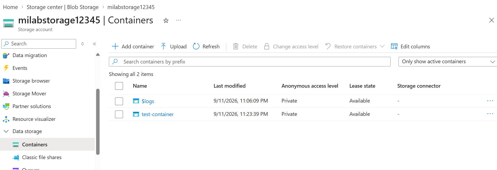
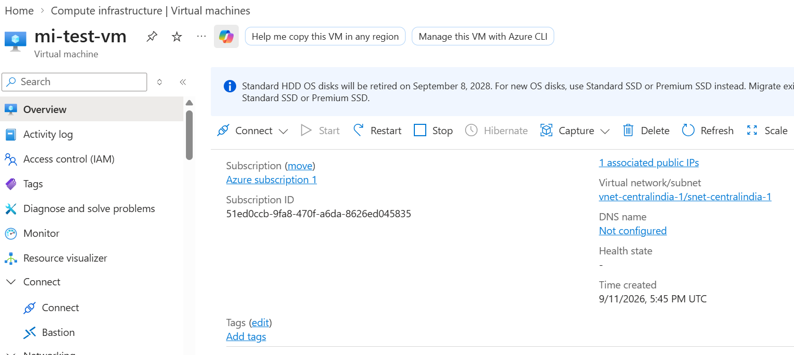
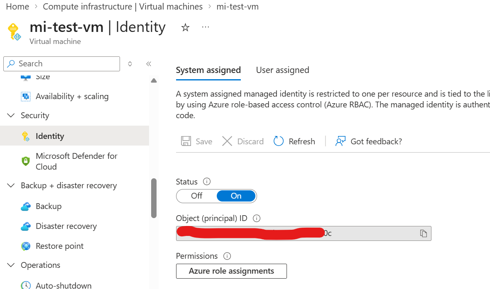
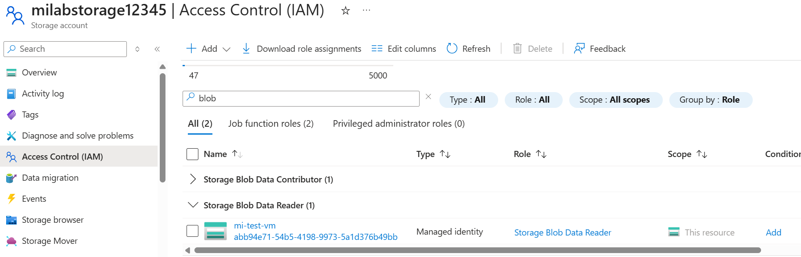
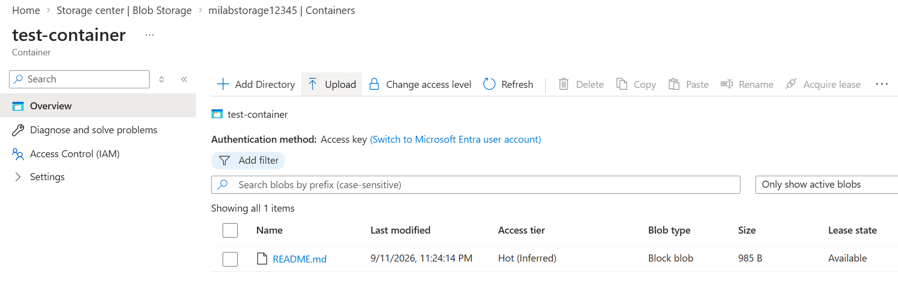
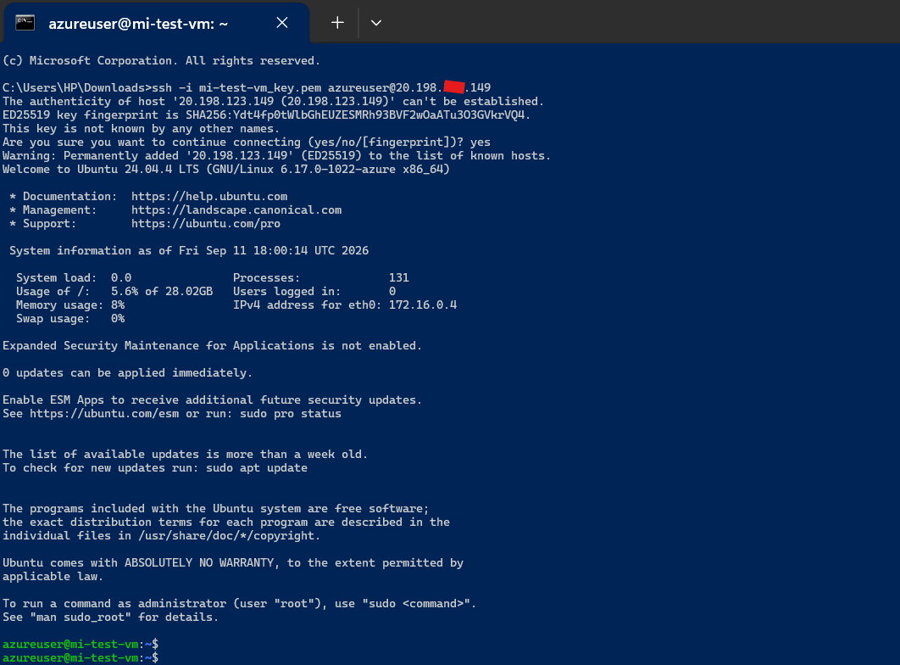
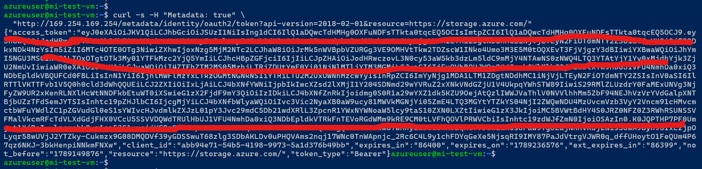

# Azure Managed Identity Lab

## 1. Overview

## 2. Objective

## 3. Scenario

## 4. Architecture

## 5. Lab Implementation
   ### Step 1 — Create Storage Account

Created an Azure Storage Account to store the test blob that will be accessed by the Azure VM using Managed Identity.

**Storage Account:** `milabstorage12345`

**Purpose:** Acts as the target Azure resource for the Managed Identity lab.



### Step 2 — Create Azure VM

Created an Ubuntu Azure Virtual Machine that represents the workload which will use Managed Identity to access Azure Storage.

**VM Name:** `mi-test-vm`

**Operating System:** Ubuntu

**Purpose:** The VM will use its Managed Identity to authenticate to Azure Storage without storing credentials.



### Step 3 — Enable System-Assigned Managed Identity

Enabled a System-Assigned Managed Identity on the Azure VM.

**Identity Type:** System-assigned

**Purpose:** Allows the VM to authenticate to Azure services without storing credentials such as passwords, client secrets, or storage keys.



### Step 4 — Assign Azure RBAC Role

Assigned the `Storage Blob Data Reader` role to the VM's System-Assigned Managed Identity at the Storage Account scope.

**Role:** Storage Blob Data Reader

**Purpose:** Allows the VM's Managed Identity to read data from Azure Blob Storage.


### Step 5 — Upload Test Blob

Uploaded a test file to the private Blob container.

**Container:** `test-container`

**Blob:** `README.md`

**Purpose:** This blob will be accessed from the VM using its Managed Identity.


### Step 6 — Connect to the VM

Connected to the Azure VM using SSH.

This provides access to the VM terminal where the Managed Identity will be used to authenticate to Azure services.


### Step 7 — Request Managed Identity Access Token

Requested an access token from the Azure Instance Metadata Service (IMDS) using the VM's Managed Identity.

```bash
curl -s -H "Metadata: true" \
  "http://169.254.169.254/metadata/identity/oauth2/token?api-version=2018-02-01&resource=https://storage.azure.com/"



## 6. Authentication vs Authorization

## 7. Testing and Validation

## 8. Interview Questions

## 9. Key Learnings

## 10. Cleanup

## 11. References
